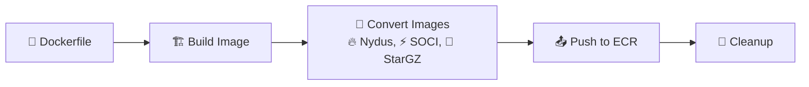

<div align="center">

<!--  -->

<div align="center">
  
</div>

# Start massive AI/ML container images 10x faster with lazy-loading snapshotters


[](https://www.python.org/downloads/)
[](https://opensource.org/licenses/MIT)
[](https://aws.amazon.com/ecr/)

[Installation](#-installation) • [Image Building](#%EF%B8%8F-creating-optimized-images) • [Performance Testing](#-performance-testing) • [Results](#-optimization-results)

</div>

---

## Introduction

AI/ML container images like vLLM, sglang, etc. are large (10GB+). With traditional OverlayFS, pulling a 10GB image from registry to an instance takes ~7-10 mins, causing:
- Overprovisioning
- High GPU idle costs, and 
- Poor user experience during traffic spikes

Fastpull uses lazy-loading snapshotters like SOCI, Nydus, etc., to accelerate massive AI/ML container start times. This repo provides installation scripts, benchmarks, and real-world performance data showing 10x improvement in container startup times for generative AI workloads.

The below graph shows performance improvments while starting a vLLM image when using lazy-loading vs OverlayFS. 

Note: The following benchmarks and scripts work on an isolated VM. If you’re running production on Kubernetes and need help implementing these snapshotters in your cluster, ping us in our Slack community and we'd happy to assist. 


<div align="center">
  
</div>

## 🎯 Testing Environment

### AI Images Used

| Image | Description |
|-------|-------------|
| **vLLM** | High throughput LLM inference server |
| **SGLang** | Lightweight fast LLM inference engine |
| **TensorRT-LLM** | NVIDIA optimized LLM inference library |
| **CUDA** | GPU compute toolkit and runtime |
| **Triton** | Flexible multi framework inference server |

All the images used in this project are pre-built and can be pulled directly from this public ECR repo. 

### Supported Snapshotters
| Snapshotter | Description | Use Case |
|------------|-------------|----------|
| **🔥 Nydus** | Dragonfly's lazy loading format | Ultra-fast cold starts |
| **⚡ SOCI** | AWS's Seekable OCI format | AWS-optimized performance |
| **🌟 StarGZ** | Google's streaming format | Bandwidth-efficient loading |
| **📦 Overlayfs** | Traditional Docker layers | Baseline comparison |


## 📦 Installation

### 🔧 Prerequisites

| Requirement | Version | Notes |
|-------------|---------|-------|
| **OS** | Ubuntu/Debian with systemd | Root access required |
| **Docker** | Latest | Container runtime |
| **Containerd** | Latest | Required for snapshotters |
| **Python** | 3.7+ | For benchmark scripts |
| **AWS CLI (optional)** | Latest |  For private ECR repos |


### ⚡ Quick Start

```bash
# 1️⃣ Install all snapshotters (requires root)
sudo python3 scripts/install_snapshotters.py

# 2️⃣ Verify installation
sudo systemctl status nydus-snapshotter-fuse.service
sudo systemctl status soci-snapshotter-grpc.service  
sudo systemctl status stargz-snapshotter.service

# 3️⃣ Configure AWS (for private ECR repos)
aws configure

# 4️⃣ Ready to benchmark! 🎉
python3 scripts/benchmark/test-bench-vllm.py --repo my-app --snapshotter nydus
```

### Configure AWS CLI (Optional)

AWS configuration is only needed for **private ECR repositories**. Public ECR repositories can be used without authentication.

**For private ECR repositories:**
```bash
# Configure AWS CLI with your credentials
aws configure

# Test access
aws sts get-caller-identity
```

**For public ECR repositories:**
```bash
# No configuration needed - public repos work without authentication
# Example: public.ecr.aws/docker/library/nginx:latest
```

### 🛠️ What Gets Installed

The installation script sets up:

| Component | Version | Purpose |
|-----------|---------|---------|
| **Nydus** | v2.3.6 | Lazy loading toolkit |
| **Nydus Snapshotter** | v0.15.3 | Containerd integration |
| **SOCI Snapshotter** | v0.11.1 | AWS seekable format |
| **StarGZ Snapshotter** | v0.17.0 | Google streaming format |
| **nerdctl** | v2.1.4 | Containerd CLI |
| **CNI Plugins** | v1.8.0 | Container networking |


## 🏗️ Creating Optimized Images

Though you can directly use our pre-built images from the following public ECR repo for TensorRT, vLLM, and SGlang. If you want to run full benchmark, you can also build and convert these images yourself using the following commands. 

### 📋 Image Format Overview

Each snapshotter requires specific image formats:

| Format | Tag Suffix | Purpose |
|--------|------------|---------|
| **Nydus** | `{tag}-nydus` | Lazy loading with RAFS |
| **SOCI** | `{tag}-soci` | Seekable OCI chunks |
| **eStargz** | `{tag}-estargz` | Google streaming format |
| **Standard** | `{tag}` | Base OCI (overlayfs/native) |

### 🤖 Automated Building

**One command to create all optimized formats!** 

> **💡 Tip:** Requires AWS authentication for ECR repos

```bash
# 🚀 Build all formats in one go
python3 scripts/build_push.py \
  --account 123456789012 \
  --image-path ./my-dockerfile-dir \
  --image-name my-vllm-app \
  --region us-east-1
```

<details>
<summary>🔧 Advanced Options</summary>

```bash
# Build specific formats only
python3 scripts/build_push.py \
  --account 123456789012 \
  --image-path ./my-dockerfile-dir \
  --image-name my-vllm-app \
  --formats normal,nydus,soci

# Keep images locally (skip cleanup)
python3 scripts/build_push.py \
  --account 123456789012 \
  --image-path ./my-dockerfile-dir \
  --image-name my-vllm-app \
  --no-cleanup
```

</details>

### ✨ What the optimization script does



1. **🏗️ Builds** base Docker image from Dockerfile
2. **📦 Creates** ECR repository automatically
3. **🔄 Converts** to all snapshotter formats  
4. **📤 Pushes** with proper tags (`latest-nydus`, `latest-soci`, etc.)
5. **🧹 Cleans** local images for fresh benchmarks

## 🚀 Performance Testing

### ⚡ Quick Start

```bash
# 🦾 vLLM with Nydus (fastest)
python3 scripts/benchmark/test-bench-vllm.py \
  --repo my-vllm-app \
  --snapshotter nydus

# 🧠 SGLang with SOCI 
python3 scripts/benchmark/test-bench-sglang.py \
  --repo my-sglang-app \
  --snapshotter soci \
  --region us-west-2

# 📊 Save results to JSON
python3 scripts/benchmark/test-bench-vllm.py \
  --repo my-app \
  --snapshotter nydus \
  --output-json results.json
```

### 🎛️ Configuration Options

| Parameter | Description | Default | Example |
|-----------|-------------|---------|---------|
| `--repo` | ECR repository name | **Required** | `my-vllm-app` |
| `--tag` | Image tag base | `latest` | `v1.2` |
| `--region` | AWS region | `us-east-1` | `us-west-2` |
| `--snapshotter` | Snapshotter type | `nydus` | `soci`, `estargz`, `overlayfs` |
| `--port` | Local port binding | 8080 (vLLM), 8000 (SGLang) | `9000` |
| `--output-json` | JSON output file | None | `results.json` |
| `--keep-image` | Keep image after test | `false` | `true` |
| `--model-mount-path` | Local SSD mount | None | `/mnt/nvme/models` |

<details>
<summary>🔧 Alternative: Full Image URL</summary>

```bash
# Use complete image URL instead of --repo
python3 scripts/benchmark/test-bench-vllm.py \
  --image custom-registry.com/my-app:tag-nydus \
  --snapshotter nydus
```

</details>

### 🏁 Comparative Performance Testing

**Test all optimization strategies in one script:**

```bash
#!/bin/bash
# 🚀 Test all optimization strategies
REPO="my-vllm-app"
OUTPUT_DIR="benchmark-results"
mkdir -p $OUTPUT_DIR

for snapshotter in nydus soci estargz overlayfs; do
  echo "🧪 Optimizing with $snapshotter..."
  
  python3 scripts/benchmark/test-bench-vllm.py \
    --repo $REPO \
    --snapshotter $snapshotter \
    --output-json "${OUTPUT_DIR}/vllm-${snapshotter}-$(date +%Y%m%d-%H%M%S).json" \
    --keep-image
    
  echo "✅ $snapshotter optimization complete"
  sleep 30  # Cool down
done
```

## 📊 Optimization Results

### 🎯 Example Results

```bash
=== 🦾 VLLM TIMING SUMMARY ===
Container Startup Time:     2.145s  # ⚡ Container creation
Container to First Log:     15.234s # 📝 First application log
Engine Initialization:      45.123s # 🚀 vLLM engine start
Weights Download Start:     67.890s # 📥 Model download begins
Weights Download Complete:  156.789s# ✅ Download finished
Weights Loaded:            198.456s # 🧠 Weights in memory
Graph Capture Complete:    245.678s # 🔥 CUDA optimization
Server Log Ready:          318.429s # 🌐 Server process ready
Server Ready:              318.435s # ✅ HTTP 200 response
Total Test Time:           325.678s # ⏱️ End-to-end time

🔍 BREAKDOWN:
Container to First Log:                      15.234s
First Log to Weight Download Start:          52.656s  
Weight Download Start to Complete:           88.899s
Weight Download Complete to Weights Loaded:  41.667s
Weights Loaded to Server Ready:             119.979s
```

### 🔬 Cold Start Phases

<details>
<summary>🦾 vLLM Phases</summary>

| Phase | What's Happening | 
|-------|------------------|
| **Container Startup** | Docker/nerdctl container creation |
| **First Log** | Application process starts |
| **Engine Init** | vLLM inference engine initialization |
| **Weight Download** | Model weights downloaded from registry |
| **Weights Loaded** | Model loaded into GPU memory |
| **Graph Capture** | CUDA graph optimization |
| **Server Ready** | HTTP API accepting requests |

</details>

<details>
<summary>🧠 SGLang Phases</summary>

| Phase | What's Happening |
|-------|------------------|
| **SGLang Init** | Framework initialization |
| **Weight Download** | Model weights download |
| **KV Cache** | Key-value cache allocation |
| **Graph Capture** | CUDA optimization (begin/end) |
| **Server Ready** | HTTP API ready |

</details>

## 🛠️ Troubleshooting

<details>
<summary>🔧 Common Issues & Solutions</summary>

### ❌ Permission Denied
```bash
sudo usermod -aG docker $USER
newgrp docker
```

### ❌ Snapshotter Service Down
```bash
sudo systemctl restart nydus-snapshotter-fuse.service
sudo systemctl restart soci-snapshotter-grpc.service
sudo systemctl restart stargz-snapshotter.service
```

### ❌ ECR Authentication Failed
```bash
aws ecr get-login-password --region us-east-1 | \
  docker login --username AWS --password-stdin {account}.dkr.ecr.us-east-1.amazonaws.com
```

### ❌ Image Not Found
```bash
aws ecr list-images --repository-name my-app --region us-east-1
```

### ❌ SOCI Issues
```bash
sudo rm -rf /var/lib/soci-snapshotter-grpc/
sudo systemctl restart soci-snapshotter-grpc.service
```

</details>

## ⚡ Performance Tips

<details>
<summary>🚀 Optimization Strategies</summary>

### 💾 Use Local SSD
```bash
python3 scripts/benchmark/test-bench-vllm.py \
  --repo my-app \
  --model-mount-path /mnt/nvme/models \
  --snapshotter nydus
```

### 🔄 Keep Images for Multiple Runs
```bash
python3 scripts/benchmark/test-bench-vllm.py \
  --repo my-app \
  --keep-image \
  --snapshotter nydus
```

### 🔥 GPU Warm-up
```bash
sudo nerdctl --snapshotter overlayfs run --rm --gpus all \
  nvidia/cuda:12.1-runtime-ubuntu20.04 nvidia-smi
```

</details>

---

<div align="center">

## 🤝 Contributing

We welcome contributions! Please feel free to submit a Pull Request.

---

**Built with ❤️ by the TensorFuse team**

[](https://opensource.org/licenses/MIT)

</div>
