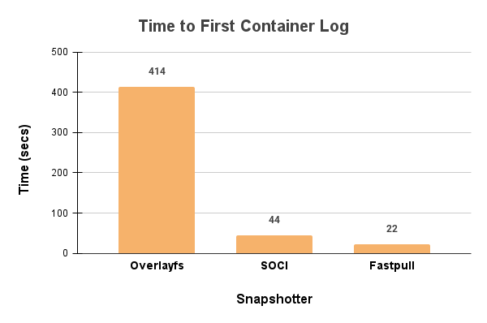

<div align="center">
  
  
</div>

<div align="center">

# Start massive AI/ML container images 10x faster with lazy-loading snapshotter
[](https://join.slack.com/t/tensorfusecommunity/shared_invite/zt-30r6ik3dz-Rf7nS76vWKOu6DoKh5Cs5w)
[](https://tensorfuse.io/docs/blogs/blog)

[Installation](#install-fastpull-on-a-vm) • [Results](#understanding-test-results) • [Detailed Usage](docs/fastpull.md)

</div>

---

## What is Fastpull?

Fastpull is a lazy-loading snapshotter that starts massive AI/ML container images (>10 GB) in seconds.

#### The Cold Start Problem

AI/ML container images like CUDA, vLLM, and sglang are large (10 GB+). Traditional Docker pulls take **7-10 minutes**, causing:

- 20-30% GPU capacity wasted from overprovisioning
- SLA breaches during traffic spikes

#### The Solution

Fastpull uses lazy-loading to pull only the files needed to start the container, then fetches remaining layers on demand. This accelerates start times by 10x. See the results below: 

<div align="center">
  
</div>

For more information, check out the [fastpull blog release](https://tensorfuse.io/docs/blogs/reducing_gpu_cold_start).

---

## Install fastpull on a VM

> [!NOTE] 
> For Kubernetes installation, [contact us](mailto:agam@tensorfuse.io) for early access to our helm chart.

### Prerequisites

- VM Image: Works on Debian 12+, Ubuntu, AL2023 VMs with GPU, mileage on other AMIs may vary.
- Python>=3.10, pip, python3-venv, [Docker](https://docs.docker.com/engine/install/), [CUDA drivers](https://docs.nvidia.com/cuda/cuda-installation-guide-linux/), [Nvidia Container Toolkit](https://docs.nvidia.com/datacenter/cloud-native/container-toolkit/latest/install-guide.html) installed

### Installation Steps

**1. Install fastpull**

```bash
git clone https://github.com/tensorfuse/fastpull.git
cd fastpull/
sudo python3 scripts/setup.py
```

You should see: **"✅ Fastpull installed successfully on your VM"**

**2. Run containers**

Fastpull requires your images to be in a special format. You can either choose from our template of pre-built images like vLLM, TensorRT, and SGlang or build your own using a Dockerfile. 

<b>Option A: Use pre-built images</b>

Test with vLLM, TensorRT, or Sglang:

```bash
fastpull quickstart tensorrt
fastpull quickstart vllm 
fastpull quickstart sglang 
```

Each of these will run two times, once with fastpull optimisations, and one the way docker runs it
After the quickstart runs are complete, we also run `fastpull clean --all` which cleans up the downloaded images. 

<b>Option B: Build custom images</b>

First, authenticate with your registry 
For ECR: 
```
aws configure; 
aws ecr get-login-password --region us-east-1 | sudo nerdctl login --username AWS --password-stdin ACCOUNT_ID.dkr.ecr.us-east-1.amazonaws.com

```

For GAR:
```
gcloud auth login;
gcloud auth print-access-token | sudo nerdctl login <REGION>-docker.pkg.dev --username oauth2accesstoken --password-stdin
```
For Dockerhub: 
```
sudo docker login
```

Build and push from your Dockerfile:

> [!NOTE] 
> - We support --registry gar, --registry ecr, --registry dockerhub 
> - For `<TAG>`, you can use any name that's convenient, ex: `v1`, `latest`


```bash
# Build and push image
fastpull build --registry <REGISTRY> --dockerfile-path <DOCKERFILE-PATH> --repository-url <ECR/GAR-REPO-URL>:<TAG> 
```

## Benchmarking with Fastpull

To get the run time for your container, you can use either: 

<b>Completion Time</b>

Use if the workload has a defined end point
```
fastpull run --benchmark-mode completion [--FLAGS] <REPO-URL>:<TAG>  
fastpull run --benchmark-mode completion --mode normal [--FLAGS] <REPO-URL>:<TAG>  
```

<b>Server Endpoint Readiness Time</b>

Use if you're preparing a server, and it send with a 200 SUCCESS response once the server is up
```
fastpull run --benchmark-mode readiness --readiness-endpoint localhost:<PORT>/<ENDPOINT> [--FLAGS] <REPO-URL>:<TAG>
fastpull run --benchmark-mode readiness --readiness-endpoint localhost:<PORT>/<ENDPOINT> --model normal [--FLAGS] <REPO-URL>:<TAG>
```

> [!NOTE]
> - When running for Readiness, you must publish the right port ex. `-p 8000:8000` and use `--readiness-endpoint localhost:8000/health`
> - Use --mode normal to run normal docker, running without this flag runs with fastpull optimisations
> - For `[--FLAGS]` you can use any docker compatible flags, ex. `--gpus all`, `-p PORT:PORT`, `-v <VOLUME_MOUNT>`
> - If using GPUs, make sure you add `--gpus all` as a fastpull run flag

#### Cleaning after a run

To get the right cold start numbers, run the clean command after each run:
```
fastpull clean --all
```

---

## Understanding Test Results

Results show the startup and completion/readiness times:

<b>Example Output</b>

```bash
==================================================
BENCHMARK SUMMARY
==================================================
Time to Container Start: 141.295s
Time to Readiness:       329.367s
Total Elapsed Time:      329.367s
==================================================
```

---

<div align="center">

## 🤝 Contributing

We welcome contributions! Submit a Pull Request or join our [Slack community](https://join.slack.com/t/tensorfusecommunity/shared_invite/zt-30r6ik3dz-Rf7nS76vWKOu6DoKh5Cs5w).

---

**Built with ❤️ by the TensorFuse team**

[](https://opensource.org/licenses/MIT)

</div>
