<div align="center">

<!--  -->

<div align="center">
  
</div>

# Start massive AI/ML container images 10x faster with lazy-loading snapshotters

<a href="https://join.slack.com/t/tensorfusecommunity/shared_invite/zt-30r6ik3dz-Rf7nS76vWKOu6DoKh5Cs5w"></a>
<a href="https://tensorfuse.io/docs/blogs/blog"></a>

[Installation](#testing-environment) • [Image Building](#creating-optimized-images) • [Results](#understanding-test-results) • [Troubleshooting](#troubleshooting)

</div>

---

## Introduction

AI/ML container images like vLLM, sglang, etc. are large (10GB+). With traditional OverlayFS, pulling a 10GB image from registry to an instance takes ~7-10 mins, causing:
- Overprovisioning
- High GPU idle costs, and 
- Poor user experience during traffic spikes

Fastpull uses lazy-loading snapshotters like SOCI, Nydus, etc., to accelerate massive AI/ML container start times. This repo provides installation scripts, benchmarks, and real-world performance data showing 10x improvement in container startup times for generative AI workloads.

The below graph shows performance improvements while starting a vLLM image when using lazy-loading vs OverlayFS. 

> [!IMPORTANT]
> The following benchmarks and scripts work on an isolated VM. If you’re running production on Kubernetes and need help implementing these snapshotters in your cluster, ping us in our Slack community and we'd be happy to assist. 


<div align="center">
  
</div>

## Testing Environment

### Container Images Used

| Image | Description | Link | 
|-------|-------------|------------------|
| **vLLM** | High throughput LLM inference server | [VLLM Image Repo](public.ecr.aws/s6z9f6e5/tensorfuse/fastpull/vllm:latest) |
| **SGLang** | Lightweight fast LLM inference engine | [SGLang Image Repo](public.ecr.aws/s6z9f6e5/tensorfuse/fastpull/sglang:latest) |
| **TensorRT-LLM** | NVIDIA optimized LLM inference library | [TensorRT Image Repo](public.ecr.aws/s6z9f6e5/tensorfuse/fastpull/tensorrt:latest) |

The image Dockerfiles are available at images/{IMAGE_NAME}/Dockerfile

All the images used in this project are pre-built and can be pulled directly from our public ECR repositories.

### Prerequisites

To replicate our setup, we recommend using the following setup from AWS:

| Requirement | Version | Notes |
|-------------|---------|-------|
| **AMI** | Deep Learning Base OSS Nvidia Driver GPU AMI | AMI: ami-0f4d5ef8f66860703 |
| **Machine Type** | G6e.xlarge | L40s GPU Machine for EC2 |
| **AWS CLI (optional)** | Latest |  For private ECR repos |


### Quick Start

```bash
# Install all snapshotters (requires root)
git clone https://github.com/tensorfuse/fastpull.git 
cd fastpull/
sudo python3 scripts/install_snapshotters.py

# Verify installation
sudo systemctl status nydus-snapshotter-fuse.service
sudo systemctl status soci-snapshotter-grpc.service  
sudo systemctl status stargz-snapshotter.service

# Start benchmark
python3 scripts/benchmark/test-bench-vllm.py \
  --image public.ecr.aws/s6z9f6e5/tensorfuse/fastpull/vllm:latest \
  --snapshotter overlayfs
python3 scripts/benchmark/test-bench-vllm.py \
  --image public.ecr.aws/s6z9f6e5/tensorfuse/fastpull/vllm:latest-nydus \
  --snapshotter nydus
python3 scripts/benchmark/test-bench-vllm.py \
  --image public.ecr.aws/s6z9f6e5/tensorfuse/fastpull/vllm:latest-soci \
  --snapshotter soci
```

##  Understanding Testing Results

### Example Results

```bash
=== VLLM TIMING SUMMARY ===
Container Startup Time:     2.145s  # Container creation
Container to First Log:     15.234s # First application log
Engine Initialization:      45.123s # vLLM engine start
Weights Download Start:     67.890s # Model download begins
Weights Download Complete: 156.789s # Download finished
Weights Loaded:            198.456s # Weights in memory
Graph Capture Complete:    245.678s # CUDA optimization
Server Log Ready:          318.429s # Server process ready
Server Ready:              318.435s # HTTP 200 response
Total Test Time:           325.678s # End-to-end time

 BREAKDOWN:
Container to First Log:                      15.234s
First Log to Weight Download Start:          52.656s  
Weight Download Start to Complete:           88.899s
Weight Download Complete to Weights Loaded:  41.667s
Weights Loaded to Server Ready:             119.979s
```

### Cold Start Phases

<details>
<summary> vLLM Phases</summary>

| Phase | What's Happening | 
|-------|------------------|
| **Container Startup** | Docker/nerdctl container creation |
| **First Log** | Application process starts |
| **Engine Init** | vLLM inference engine initialization |
| **Weight Download** | Model weights downloaded from registry |
| **Weights Loaded** | Model loaded into GPU memory |
| **Graph Capture** | CUDA graph optimization |
| **Server Ready** | HTTP API accepting requests |

</details>

<details>
<summary> SGLang Phases</summary>

| Phase | What's Happening |
|-------|------------------|
| **SGLang Init** | Framework initialization |
| **Weight Download** | Model weights download |
| **KV Cache** | Key-value cache allocation |
| **Graph Capture** | CUDA optimization (begin/end) |
| **Server Ready** | HTTP API ready |

</details>

## Understanding Snapshotters

### Snapshotter in Containerd
The Snapshotter is a component within Containerd responsible for managing the file system layers that make up a container image. Its primary job is to prepare and manage directories (snapshots) where each layer of a container image is unpacked and merged with previous layers, so the resulting directory reflects the current state of the container file system at any given layer. 

Lazy loading is achieved by using different snapshotters.

### Supported Snapshotters for FastPull

| Snapshotter | Description | Use Case |
|------------|-------------|----------|
| **Nydus** | Dragonfly's lazy loading format | Ultra-fast cold starts |
| **SOCI** | AWS's Seekable OCI format | AWS-optimized performance |
| **StarGZ** | Google's streaming format | Bandwidth-efficient loading |
| **Overlayfs** | Traditional Docker layers | Baseline comparison |

### OverlayFS - the default Snapshotter

OverlayFS is the default snapshotter. It uses the Linux kernel’s overlay filesystem module to stack image layers. Any writes go to an upper directory while reads check lower layers in order. 

### Nydus 
A chunk-based, content-addressable filesystem. It performs chunk-level deduplication, which can result in smaller image sizes. Nydus also requires image conversion to its RAFS (Registry Acceleration File System) format.

Read more: [Nydus Official Website](https://nydus.dev/)

### SOCI
An AWS-developed snapshotter. It creates a separate index for an existing OCI image without requiring image conversion. The index contains metadata about file locations within the compressed layers, enabling on-demand fetching.

Read more: [SOCI's Github Page](https://github.com/awslabs/soci-snapshotter)

### (e)StarGZ
An OCI-compatible image format that embeds a table of contents within the image layers. This approach requires a full conversion of the original image to the eStargz format.

Read more: [StarGZ's Github Page](https://github.com/containerd/stargz-snapshotter)

## Advanced Configuration

### Testing Configuration Options

| Parameter | Description | Default | Example |
|-----------|-------------|---------|---------|
| --image | Full URL for the repository | none | custom-registry.com/my-app:tag-nydus |
| --repo | ECR repository name | none | my-vllm-app |
| `--tag` | Image tag base | `latest` | `v1.2` |
| `--region` | AWS region | `us-east-1` | `us-west-2` |
| `--snapshotter` | Snapshotter type | `nydus` | `soci`, `estargz`, `overlayfs` |
| `--port` | Local port binding | 8080 (vLLM), 8000 (SGLang) | `9000` |
| `--output-json` | JSON output file | None | `results.json` |
| `--keep-image` | Keep image after test | `false` | `true` |
| `--model-mount-path` | Local SSD mount | None | `/mnt/nvme/models` |

Use either the full image path with `--image` or combine `--repo` with `--tag`.

<details>
<summary>🔧 Alternative: Full Image URL</summary>

```bash
# Use complete image URL instead of --repo
python3 scripts/benchmark/test-bench-vllm.py \
  --image custom-registry.com/my-app:tag-nydus \
  --snapshotter nydus
```

</details>

### What Gets Installed

The installation script sets up:

| Component | Version | Purpose |
|-----------|---------|---------|
| **Nydus** | v2.3.6 | Lazy loading toolkit |
| **Nydus Snapshotter** | v0.15.3 | Containerd integration |
| **SOCI Snapshotter** | v0.11.1 | AWS seekable format |
| **StarGZ Snapshotter** | v0.17.0 | Google streaming format |
| **nerdctl** | v2.1.4 | Containerd CLI |
| **CNI Plugins** | v1.8.0 | Container networking |

### Configure AWS CLI (Optional)

AWS configuration is only needed for **private ECR repositories**. Public ECR repositories can be read from without authentication, although pushing to one will require authentication

**For private ECR repositories:**
```bash
# Configure AWS CLI with your credentials
aws configure

# Test access
aws sts get-caller-identity

# Login to repository
aws ecr get-login-password --region $REGION | nerdctl login --username AWS --password-stdin $ACCOUNT.dkr.ecr.$REGION.amazonaws.com
aws ecr get-login-password --region $REGION | sudo nerdctl login --username AWS --password-stdin $ACCOUNT.dkr.ecr.$REGION.amazonaws.com
```

**For public ECR repositories:**
```bash
# No configuration needed - public repos work without authentication
```

### Creating Optimized Images

Though you can directly use our pre-built images from the following public ECR repo for TensorRT, vLLM, and SGLang. If you want to run full benchmark, you can also build and convert images yourself using the following commands. 

### Image Format Overview

Each snapshotter requires specific image formats:

| Format | Tag Suffix | Purpose |
|--------|------------|---------|
| **Nydus** | `{tag}-nydus` | Lazy loading with RAFS |
| **SOCI** | `{tag}-soci` | Seekable OCI chunks |
| **eStargz** | `{tag}-estargz` | eStargz streaming format |
| **Standard** | `{tag}` | Base OCI (overlayfs/native) |

### Automated Building

**One command to create all optimized formats!** 

> [!IMPORTANT]
> Requires AWS authentication for ECR repos

```bash
# 🚀 Build all formats in one go
python3 scripts/build_push.py \
  --account 123456789012 \
  --image-path ./my-dockerfile-dir \
  --image-name my-vllm-app \
  --region us-east-1
```

<details>
<summary>🔧 Advanced Options</summary>

```bash
# Build specific formats only
python3 scripts/build_push.py \
  --account 123456789012 \
  --image-path ./my-dockerfile-dir \
  --image-name my-vllm-app \
  --formats normal,nydus,soci

# Keep images locally (skip cleanup)
python3 scripts/build_push.py \
  --account 123456789012 \
  --image-path ./my-dockerfile-dir \
  --image-name my-vllm-app \
  --no-cleanup
```

</details>

### What the optimization script does

```mermaid
graph LR
    A[📁 Dockerfile] --> B[ Build Image]
    B --> C[🔄 Convert Images<br/> Nydus, SOCI, StarGZ]
    C --> D[📤 Push to ECR]
    D --> E[🧹 Cleanup]
```



1. **Builds** base Docker image from Dockerfile
2. **Creates** ECR repository automatically
3. **Converts** to all snapshotter formats  
4. **Pushes** with proper tags (`latest-nydus`, `latest-soci`, etc.)
5. **Cleans** local images for fresh benchmarks

## Troubleshooting

<details>
<summary> Common Issues & Solutions</summary>

### ❌ Permission Denied
```bash
sudo usermod -aG docker $USER
newgrp docker
```

### ❌ Snapshotter Service Down
```bash
sudo systemctl restart nydus-snapshotter-fuse.service
sudo systemctl restart soci-snapshotter-grpc.service
sudo systemctl restart stargz-snapshotter.service
```

### ❌ ECR Authentication Failed
```bash
aws configure # Setup AWS account
aws ecr get-login-password --region {region} | \
  docker login --username AWS --password-stdin {account}.dkr.ecr.{region}.amazonaws.com
aws ecr get-login-password --region {region} | \
  sudo docker login --username AWS --password-stdin {account}.dkr.ecr.{region}.amazonaws.com
```

### ❌ Image Not Found

Check if repository/image exists
```bash
aws ecr list-images --repository-name my-app --region us-east-1
```

### ❌ SOCI Issues

The cache from soci can sometimes not be erased when we use `nerdctl rmi`. To solve this, manually delete the cache files

```bash
sudo rm -rf /var/lib/soci-snapshotter-grpc/
sudo systemctl restart soci-snapshotter-grpc.service
```

Moreover, SOCI might not run on other Clouds/AMIs. Check for SOCI compatibility with your AMI provider.

</details>

## ⚡ Performance Tips

<details>
<summary> Optimization/Testing Strategies</summary>

### Use Local SSD
```bash
python3 scripts/benchmark/test-bench-vllm.py \
  --repo my-app \
  --model-mount-path /mnt/nvme/models \
  --snapshotter nydus
```

### Keep Images for Multiple Runs

This will let you test for image performance once it starts, but it will not give any information regarding cold starts

```bash
python3 scripts/benchmark/test-bench-vllm.py \
  --repo my-app \
  --keep-image \
  --snapshotter nydus
```

</details>

---

<div align="center">

## 🤝 Contributing

We welcome contributions! Please feel free to submit a Pull Request.

---

**Built with ❤️ by the TensorFuse team**

[](https://opensource.org/licenses/MIT)

</div>
